# PR Review Harness Agent Platform

> 一个面向 GitHub PR 审查场景的工程化 Harness Agent 系统。  
> 核心不是“调用大模型生成 Review”，而是把 LLM、工具、状态、评估、恢复、告警和人工接管组合成一套稳定可运营的研发智能体框架。

本项目已经从普通 AI 平台演进为 **PR Review Harness Agent**：

- 不是简单 Prompt
- 不是一次性代码审查脚本
- 不是只接入大模型 API
- 而是一个具备 **上下文治理、工具调用、执行编排、状态记忆、离线评估、线上观测、错误恢复、人工接管、告警运营** 的 Agent Harness

当前 Harness 核心能力完成度：**98%+**。

---

## 1. 项目定位

这个项目的核心定位是：

> **用 Harness Engineering 的方式，把 GitHub PR Review 从“模型生成文本”升级为“可治理、可恢复、可评估、可运营的 Agent 系统”。**

它解决的不是单点模型能力问题，而是 Agent 工程化问题：

| 传统 PR Review AI | 本项目 Harness Agent |
| --- | --- |
| 一次性 Prompt 生成 | 多阶段执行编排 |
| 只看 diff | 风险排序 + 文件摘要 + 工具上下文 + 历史记忆 |
| 模型失败就失败 | 错误分类 + 降级重试 + checkpoint/resume |
| 结果不可解释 | agent_trace 全链路可观测 |
| 无法判断质量 | 离线 eval + LLM Judge + A/B compare |
| 无运营闭环 | dashboard + alert + manual_handoff |

---

## 2. Harness Agent 总体架构

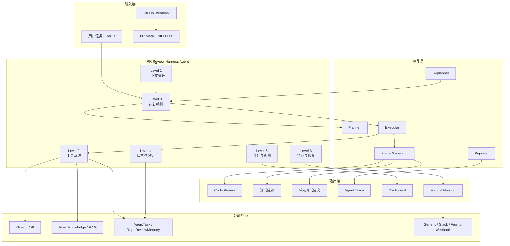

---

## 3. Harness Engineering 六层模型

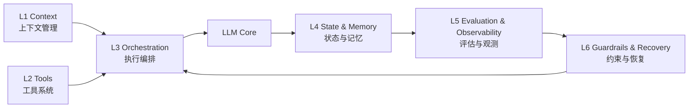

| 层级 | 目标 | 当前能力 |
| --- | --- | --- |
| Level 1 上下文管理 | 控制模型看到什么 | 风险排序、文件级摘要、阶段预算、降级上下文、知识上下文、仓库记忆 |
| Level 2 工具系统 | 控制模型能调用什么 | PR meta、diff、commits、checks、issue、code search、依赖上下文、跨 PR 关联、RAG |
| Level 3 执行编排 | 控制下一步做什么 | Planner / Executor / Replanner / Reporter、状态机、阶段生成、checkpoint/resume |
| Level 4 状态与记忆 | 控制系统记住什么 | AgentTask、agent_trace、repo-level memory、阶段 checkpoint |
| Level 5 评估与观测 | 控制如何判断好坏 | 离线 eval、LLM Judge、A/B compare、observability trace、dashboard |
| Level 6 约束与恢复 | 控制失败后怎么办 | 幂等、错误分类、恢复策略矩阵、降级重试、人工接管、告警、告警去重 |

---

## 4. PR Review Agent 执行流程

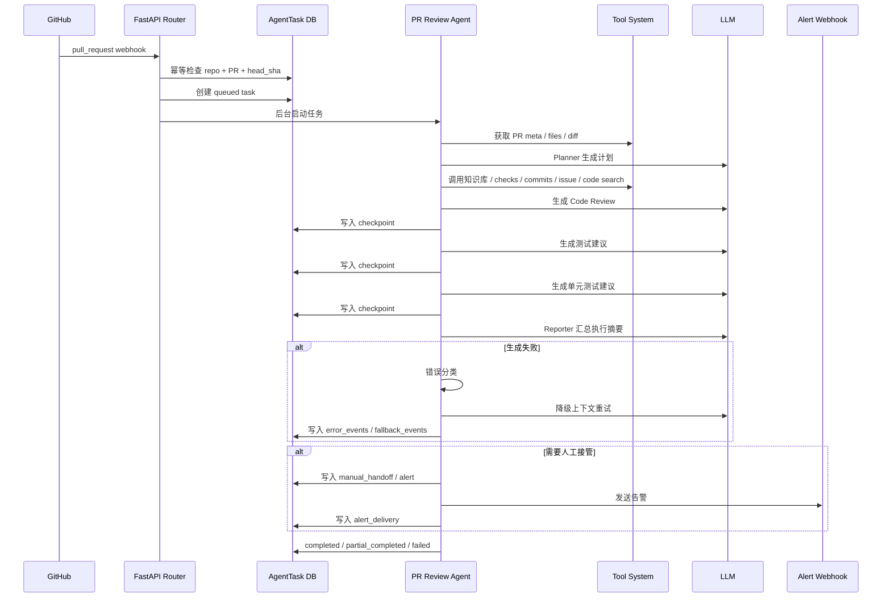

---

## 5. 上下文管理：从“塞 diff”到“上下文治理”

PR Review 最容易失败的地方不是模型不会说，而是上下文给得不对。

本项目的上下文管理目标是：

> 让模型看到最有审查价值的信息，而不是把所有内容无差别塞进去。

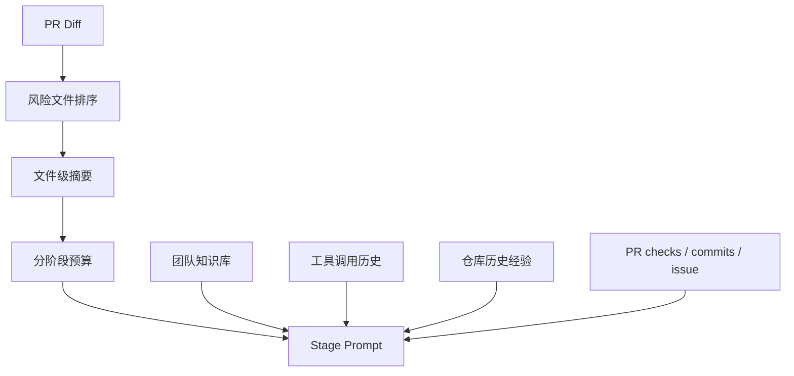

关键能力：

- PR 文件风险排序
- diff 长度预算
- 文件级摘要
- review / test / unit test 不同上下文视图
- 工具上下文分区
- 知识库上下文分区
- repo-level memory 注入
- 降级重试上下文预算

相关配置：

```env
PR_CONTEXT_PLANNER_DIFF_CHARS=5000
PR_CONTEXT_STAGE_DIFF_CHARS=12000
PR_CONTEXT_STAGE_SUMMARY_CHARS=2200
PR_CONTEXT_DEGRADED_DIFF_CHARS=6000
PR_CONTEXT_TOOL_HISTORY_CHARS=1200
PR_CONTEXT_KNOWLEDGE_CHARS=1800
```

---

## 6. 工具系统：让 Agent 主动获取审查证据

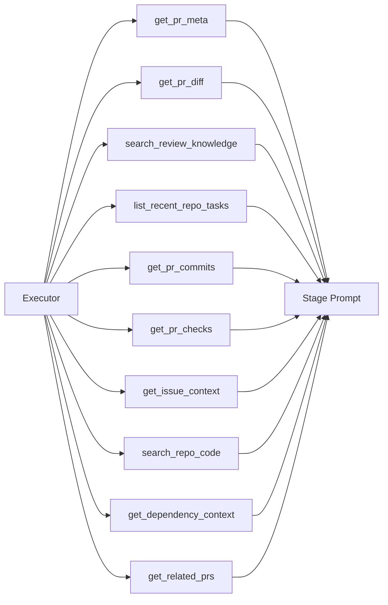

| 工具 | 价值 |
| --- | --- |
| `get_pr_meta` | 获取 PR 标题、描述、分支、文件数量 |
| `get_pr_diff` | 获取可审查 diff |
| `search_review_knowledge` | 检索团队 Code Review / 测试规范 |
| `list_recent_repo_tasks` | 读取仓库近期审查任务 |
| `get_pr_commits` | 理解提交演化和修复路径 |
| `get_pr_checks` | 纳入 CI / checks 状态 |
| `get_issue_context` | 读取关联 issue 背景 |
| `search_repo_code` | 搜索仓库相关实现位置 |
| `get_dependency_context` | 基于 diff 符号搜索依赖/调用链上下文 |
| `get_related_prs` | 关联历史相似 PR |

工具设计原则：

- 白名单化
- 输入输出稳定
- 结果进入 trace
- 失败可降级
- 重要 PR 自动补更多工具上下文

---

## 7. 执行编排：从 Prompt 到状态机

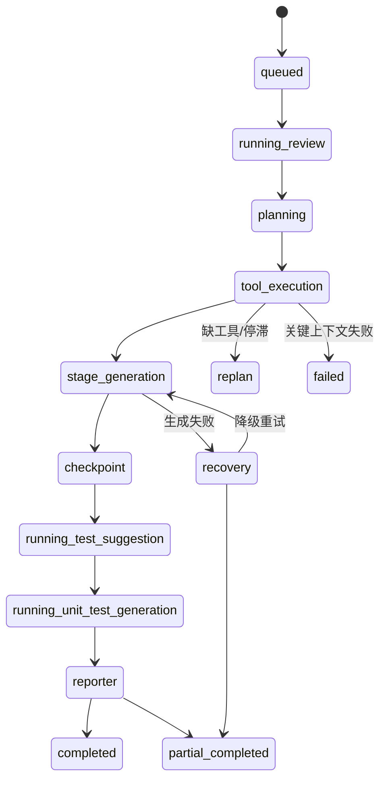

核心角色：

- **Planner**：判断 PR 类型、风险重点、工具需求
- **Executor**：决定下一步调用工具还是生成阶段结果
- **Replanner**：在停滞、失败、缺上下文时重规划
- **Reporter**：汇总执行轨迹与最终状态

当前支持：

- 多阶段执行
- 阶段强制补全
- 停滞检测
- 重规划
- checkpoint/resume
- partial completed
- trace 持久化

---

## 8. 状态与记忆：从单次任务到跨任务经验

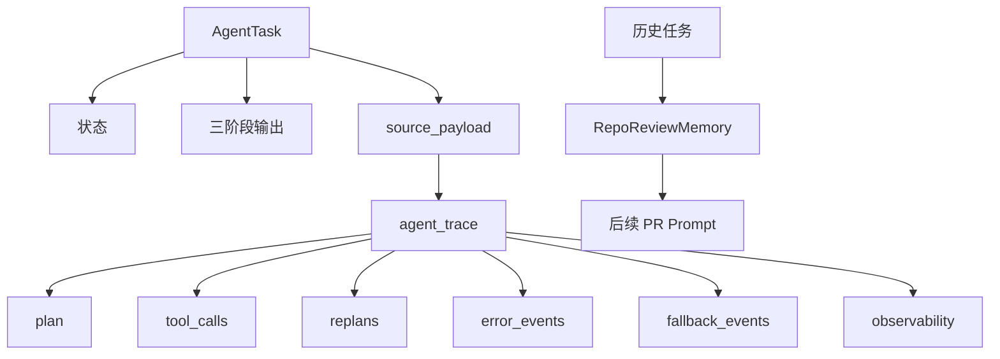

状态：

- `queued`
- `running`
- `running_review`
- `running_test_suggestion`
- `running_unit_test_generation`
- `completed`
- `partial_completed`
- `failed`

记忆：

- repo-level review memory
- 高频风险模式
- 高频测试关注
- 历史审查任务来源
- 后续 PR 自动复用经验

---

## 9. 评估与观测：让 Agent 改进可验证

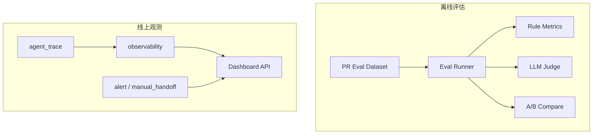

离线评估：

- PR review eval dataset
- schema 校验
- stage-only / full-agent 两种模式
- 规则指标
- LLM Judge
- Markdown report
- A/B compare
- regression flags

线上观测：

- 总耗时
- 阶段耗时
- 工具耗时
- fallback 次数
- replan 次数
- checkpoint 命中
- 错误分类
- 恢复动作
- 告警投递
- dashboard 汇总

Dashboard API：

```http
GET /api/github/dashboard?days=7
GET /api/github/dashboard?days=30&repo_id=1
```

返回：

- `summary`
- `status_counts`
- `error_category_counts`
- `recovery_counts`
- `daily_trends`
- `top_repositories`
- `recent_tasks`

---

## 10. 约束与恢复：让失败可控

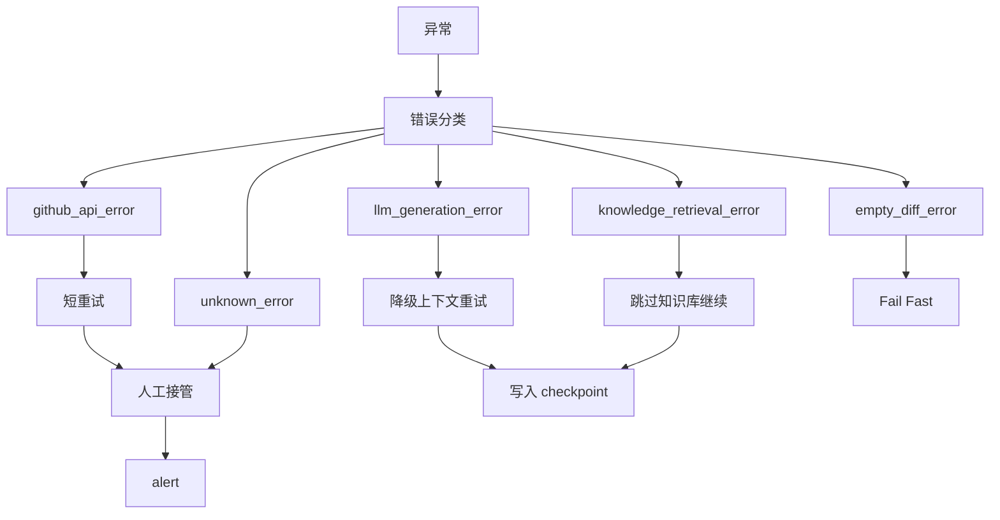

| 错误类型 | 恢复策略 |
| --- | --- |
| `github_api_error` | 短重试，仍失败则人工接管 |
| `llm_generation_error` | 降级上下文重试 |
| `knowledge_retrieval_error` | 跳过知识库继续 |
| `empty_diff_error` | fail fast，避免无依据生成 |
| `unknown_error` | 记录并人工接管 |

恢复能力：

- webhook 幂等
- 错误分类
- 恢复策略矩阵
- 降级重试
- checkpoint/resume
- partial completed
- manual handoff
- alert
- alert dedupe

---

## 11. 告警与人工接管

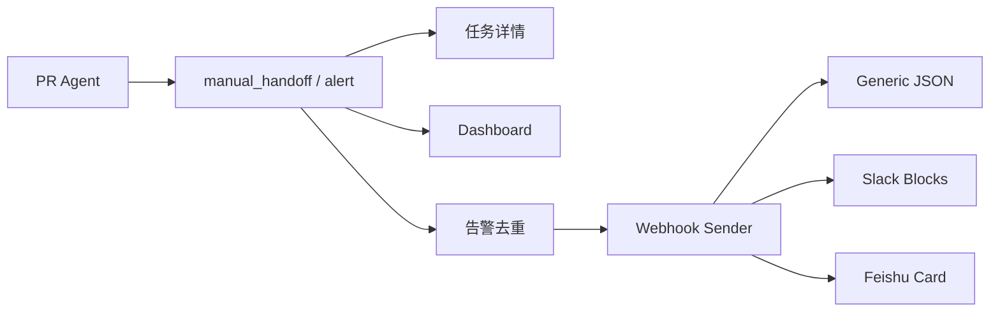

触发人工接管：

- GitHub 上下文获取失败
- diff 为空
- 任务部分完成
- 多次 fallback / replan
- 未知错误

告警配置：

```env
PR_ALERT_WEBHOOK_URL=
PR_ALERT_PROVIDER=generic
PR_ALERT_TIMEOUT=10
PR_ALERT_DEDUPE_WINDOW_MINUTES=120
```

支持 provider：

- `generic`
- `slack`
- `feishu`

告警投递 trace：

- `attempted`
- `delivered`
- `deduped`
- `signature`

---

## 12. RAG 知识库能力

RAG 仍然是这个项目的重要基础能力。  
在当前 Harness Agent 架构里，它既可以作为独立的团队知识库问答链路，也可以作为 PR Agent 的 **知识工具层**，为 Code Review 提供团队规范、历史约定和测试标准。

### RAG 核心架构图

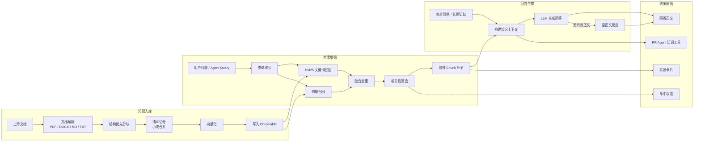

### RAG 亮点

- **不是简单接向量库**：完整覆盖文档解析、分块、向量化、混合检索、回答生成和来源追溯。
- **混合检索**：结合 `BM25 + 向量检索`，避免纯语义检索漏掉关键术语。
- **结构优先分块**：优先保留标题、列表、段落等结构信息，减少知识块语义断裂。
- **邻接 Chunk 补全**：检索命中后补充相邻片段，让答案上下文更完整。
- **来源可追溯**：回答时保留来源卡片，方便用户验证答案依据。
- **可被 Agent 工具化调用**：PR Agent 可以通过 `search_review_knowledge` 检索团队审查规范和测试规范。

### RAG 难点与解决思路

| 难点 | 问题表现 | 解决方式 |
| --- | --- | --- |
| 文档解析质量不稳定 | PDF / DOCX 解析后结构丢失，影响检索 | 优先使用 `MarkItDown`，失败时降级处理 |
| 分块太粗 | 命中内容过大，答案容易泛化 | 结构优先切分，再做语义边界控制 |
| 分块太碎 | 命中片段不完整，答案缺上下文 | 小块合并 + 邻接 chunk 补全 |
| 只靠向量召回不稳 | 专有名词、配置项、函数名可能漏召回 | 引入 BM25 与向量混合召回 |
| 检索结果有噪声 | 模型拿到无关上下文，回答漂移 | 相关性筛选后再构建最终上下文 |
| 生成结果可能空正文 | 部分模型只返回 reasoning 或空内容 | 增加空正文兜底，避免前端展示异常 |

### RAG 与 Harness Agent 的关系

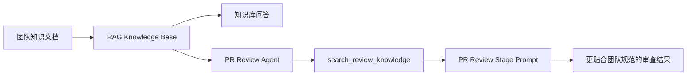

也就是说，RAG 在本项目中有两层价值：

1. **独立问答能力**：让团队文档可检索、答案可追溯。
2. **Agent 工具能力**：让 PR Agent 在审查时能主动引用团队规范，而不是只依赖模型通用知识。

---

## 13. 核心目录

```text
backend/
  routers/
    github_router.py              # GitHub Agent API / dashboard / webhook
  services/
    pr_review_agent_service.py    # PR Review Harness Agent 主流程
    pr_review_tool_service.py     # PR Agent 工具系统
    agent_service.py              # 任务调度、恢复、告警、人工接管
    alert_service.py              # generic / slack / feishu webhook 告警
    github_service.py             # GitHub API 封装
    rag_service.py                # RAG 检索
  evaluation/
    pr_review/                    # PR Review 离线评估体系
  models/
    agent_task.py                 # Agent 任务状态
    repo_review_memory.py         # Repo-level review memory

frontend/
  # GitHub Agent 页面、任务结果、trace 展示
```

---

## 14. 技术栈

### Harness / Agent

- Planner / Executor / Replanner / Reporter
- Tool whitelist
- Agent trace
- Checkpoint / resume
- Recovery strategy matrix
- Manual handoff
- Alert webhook

### Backend

- FastAPI
- SQLAlchemy
- SQLite
- Redis
- ChromaDB
- OpenAI-compatible API
- httpx

### Frontend

- React
- TypeScript
- Vite
- Tailwind CSS
- Zustand
- React Markdown

### Evaluation

- Offline dataset
- Rule metrics
- LLM as Judge
- A/B compare
- Markdown report

---

## 15. 快速启动

### 后端

```bash
cd backend
python -m venv .venv
source .venv/bin/activate
pip install -r requirements.txt
cp .env.example .env
uvicorn main:app --reload --port 8000 --workers 1
```

### 前端

```bash
cd frontend
npm install
npm run dev
```

---

## 16. 关键环境变量

```env
OPENAI_API_KEY=
OPENAI_BASE_URL=
CHAT_MODEL=
PR_AGENT_CONTROL_MODEL=
PR_AGENT_GENERATION_MODEL=

DATABASE_URL=sqlite+aiosqlite:///./app.db
REDIS_URL=redis://localhost:6379/0

GITHUB_API_BASE_URL=https://api.github.com
GITHUB_DIFF_MAX_FILES=20
GITHUB_DIFF_MAX_CHARS=24000

PR_ALERT_WEBHOOK_URL=
PR_ALERT_PROVIDER=generic
PR_ALERT_TIMEOUT=10
PR_ALERT_DEDUPE_WINDOW_MINUTES=120
```

---

## 17. 部署

### 只部署 backend

```bash
./deploy_backend_only.sh
```

### 部署前后端

```bash
./deploy.sh
```

---

## 18. 当前能力总览

| 能力 | 状态 |
| --- | --- |
| GitHub webhook 触发 | 已完成 |
| PR 任务幂等 | 已完成 |
| Planner / Executor / Replanner / Reporter | 已完成 |
| PR meta / diff / commits / checks | 已完成 |
| issue 背景 / code search | 已完成 |
| 依赖/调用链上下文 | 已完成 |
| 跨 PR 关联 | 已完成 |
| 团队知识库检索 | 已完成 |
| repo-level memory | 已完成 |
| checkpoint/resume | 已完成 |
| 错误分类与恢复策略 | 已完成 |
| 离线评估 / LLM Judge / A/B compare | 已完成 |
| observability trace | 已完成 |
| dashboard API | 已完成 |
| manual handoff | 已完成 |
| generic / slack / feishu webhook 告警 | 已完成 |
| 告警去重 | 已完成 |

---

## 19. 剩余增强项

当前核心 Harness Agent 已基本闭环，剩余主要是增强项：

1. **图表化 Dashboard**
   - 状态趋势图
   - 错误分布图
   - 恢复动作统计
   - 仓库对比视图

2. **深度静态分析**
   - 符号级引用定位
   - 更精确依赖图
   - 调用链深度分析

3. **人审工作台**
   - 接管任务池
   - 人工处理状态
   - 处理备注
   - 审批流

4. **长期质量闭环**
   - 人工反馈进入 eval dataset
   - 周期报告
   - 指标驱动 prompt / tool 调整

---

## 20. 总结

这个项目已经不是普通 AI 应用，而是一个接近完整的 **PR Review Harness Agent Platform**。

它把 LLM 从“生成文本的模型”放进一个工程化外壳里，通过：

- 上下文治理
- 工具系统
- 执行编排
- 状态记忆
- 评估观测
- 约束恢复
- 人工接管
- 告警运营

把 PR 审查做成了一套可持续迭代的研发智能体系统。

一句话概括：

> **这不是一个 PR Review Prompt，而是一个面向代码审查场景的 Harness Agent 工程平台。**

---

## 21. 补充文档

- [DEPLOYMENT.md](./DEPLOYMENT.md)
- [harness engineering.md](./harness%20engineering.md)
- [harness roadmap.md](./harness%20roadmap.md)
- [backend/evaluation/README.md](./backend/evaluation/README.md)
- [backend/prompts/README.md](./backend/prompts/README.md)
