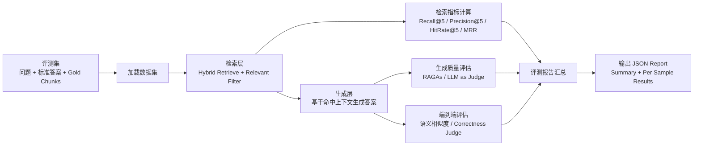
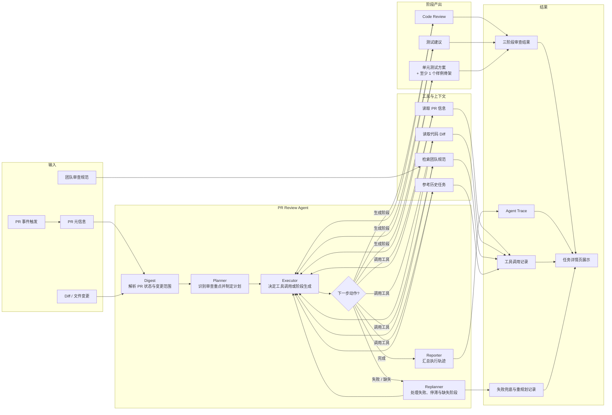
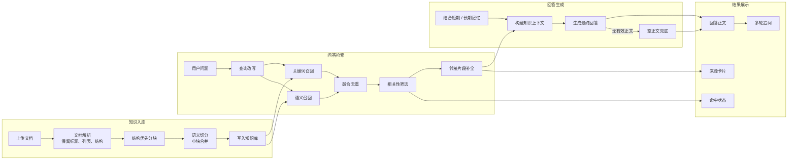

# 武大计算机学院校企合作 AI 研发协作平台

> 一个面向研发协作场景的 AI 平台，重点解决团队知识检索、会话记忆、Code Review 和 GitHub PR 自动审查问题。  
> 我重点完成了 RAG 知识库问答闭环与 Agent 化 PR 审查闭环。  
> 项目价值在于：可追溯回答、可治理 Agent、真实工程问题优化，而不是单纯的大模型接入。

面向研发协作场景的一体化 AI 平台，围绕团队知识库问答、会话记忆、Code Review 和 GitHub PR 自动审查，打通了从文档解析、RAG 检索增强到 Agent 调度执行的完整闭环。

这个项目的重点不是做一个普通聊天页面，而是把研发团队中的高频工作流真正工程化落地：让团队文档可检索、回答结果可追溯、审查流程可自动化、Agent 执行过程可观测，并通过配置治理与部署治理，逐步把“能跑的 Demo”做成“可复用、可迭代的平台能力”。

---

## 项目价值

这个项目解决的是研发协作中的三个高频问题：

- 团队文档分散，知识难检索、难复用
- 多轮沟通缺少上下文延续，历史偏好无法沉淀
- Code Review 和 PR 审查高度依赖人工，效率低且过程不可追踪

围绕这些问题，项目形成了 4 条已经打通的核心链路：

- 团队知识库问答
- 多轮会话与记忆
- 手动 Code Review
- GitHub PR 自动审查

相比“接一个大模型接口”的简单集成，这个项目更强调两类能力：

- **RAG 工程能力**：文档解析、分块优化、混合检索、来源追溯、记忆增强
- **Agent 平台能力**：状态机控制、工具调度、异常兜底、轨迹可视化、链路治理

---

## 项目速览

### 做了什么

- 搭建团队知识库问答全链路：解析、分块、向量化、混合检索、来源展示
- 实现短期记忆与长期记忆机制，支持多轮对话上下文延续
- 将聊天模块升级为支持工具调用的 ChatAgent，而不是纯 Prompt 问答
- 将 GitHub PR 审查升级为 Agent 化链路，支持 Planner / Executor / Replanner / Reporter 四角色编排
- 支持三阶段产出：Code Review、测试建议、单元测试建议 / 示例骨架
- 前端可展示任务状态、阶段结果、Agent Trace、工具调用记录、重规划记录和知识来源

### 项目价值

- 不是简单接向量库，而是围绕真实问答质量做过多轮 RAG 优化
- 不是简单串几个 Prompt，而是把 PR 审查做成了可调度、可观测、可治理的 Agent 工作流
- 不只是做功能，还处理了 embedding 维度冲突、空正文输出、JSON 不稳定、部署污染等真实工程问题
- 不只是能演示，而是具备持续迭代和长期维护的工程基础

---

## 核心亮点

### 1. RAG 不是简单接向量库，而是完整问答链路落地

项目支持 `txt / md / pdf / docx` 文档上传，并完成了解析、分块、向量化、检索增强和回答生成的全链路实现：

- PDF / DOCX 优先使用 `MarkItDown` 解析，失败自动降级
- 检索采用 `BM25 + 向量检索`
- 支持查询改写、相关性筛选、来源卡片展示
- 支持多轮追问、短期记忆和长期记忆
- 命中知识库时返回来源，增强回答可解释性

这部分的目标不是“能检索”，而是让系统尽可能回答出“文档里到底怎么做”，并且让答案有出处、可验证。

### 2. 文档分块做过多轮质量优化

项目针对 RAG 中最关键的“知识单元切分”做了多轮迭代，而不是直接使用默认切块策略。

围绕“切块太粗召回不准”和“切块太碎答案不完整”两个问题，逐步优化为：

- 结构优先分块
- 语义边界二次切分
- 小块合并
- token 上限兜底
- 检索后补相邻 chunk，恢复更完整的知识单元

这部分优化直接影响真实问答质量，也是项目里最有工程含量的 RAG 能力之一。

### 3. 聊天模块实现的是 ChatAgent，而不是纯 Prompt 问答

聊天链路并不是单轮 Prompt 拼接，而是实现了轻量化的 ChatAgent 能力：

- 能判断是直接回答还是调用工具
- 支持知识库、文档、任务、仓库等平台内数据查询
- 命中知识库时返回来源
- 模型空正文时提供 fallback，不把异常结果直接暴露给前端

这使聊天模块从“问一句答一句”升级为“可调用平台能力的智能入口”。

### 4. GitHub PR 自动审查具备 Agent 化调度能力

PR 自动审查不是简单串几个 Prompt，而是拆成四个角色：

- Planner
- Executor
- Replanner
- Reporter

同时支持三阶段输出：

1. Code Review
2. 测试建议
3. 单元测试建议 / 示例骨架

前端支持展示：

- 任务状态
- 三阶段结果
- Agent 执行轨迹
- 工具调用记录
- 重规划记录
- 知识来源

这条链路的重点不只是“生成审查意见”，而是把审查任务做成可追踪、可回放、可调试的 Agent 工作流。

---

## Agent 工程化设计

Agent 平台最重要的不是把模型接上，而是把不确定的模型能力工程化，做成一个可复用、可治理、可迭代的系统。

### 1. 把模型输出变成系统状态机

在 PR 审查链路中，我没有让模型自由生成全部结果，而是把任务拆成 Planner、Executor、Replanner、Reporter 四类角色，并明确阶段、动作、工具和状态流转。

这意味着系统不是依赖模型“一次性生成正确答案”，而是把复杂任务拆成多步受控执行过程，从而降低链路失控和结果漂移的概率。

### 2. 把不稳定输出工程化处理

项目中实际遇到过很多典型问题：

- 只返回 `reasoning_content`
- 不返回最终正文
- JSON 解析失败
- 某个阶段空结果
- 返回内容可读性差，无法直接展示

针对这些问题，我没有停留在“换模型”或“改 Prompt”，而是补齐了多层兜底：

- JSON 失败兜底
- 阶段缺失补生成
- fallback 文案
- 空结果不直接暴露给前端
- 控制层与展示层之间增加异常拦截

目标不是追求模型永不出错，而是保证系统即使在模型不稳定时，仍然可以输出可展示、可解释、可恢复的结果。

### 3. 把 Agent 做成可治理链路

为了避免 Agent 成为黑盒流程，项目增加了多种治理能力：

- 工具白名单
- 阶段白名单
- 规则 fallback
- 执行轨迹落库
- 前端展示 Agent Trace、工具调用、重规划记录、兜底事件

这意味着系统不仅能输出结果，还能解释“为什么这样执行”“中间调用了什么”“在哪一步发生了偏差”，便于调试、复盘和后续迭代。

### 4. 把模型能力和业务能力解耦

项目不是把所有逻辑都堆到一个 Prompt 里，而是逐步做了职责拆分：

- 控制层与生成层职责拆分
- PR Agent 双模型配置
- RAG、聊天、PR 审查按链路拆开治理

这样做的价值在于：模型能力不再直接等于业务能力，平台可以针对不同链路分别优化稳定性、成本和效果，把“模型能力”沉淀成“平台能力”。

### 5. 把一次性 Demo 做成可迭代系统

为了支持长期维护和持续优化，项目还做了很多底层工程支撑：

- Prompt 独立目录化管理
- 配置、代码、数据分离
- 部署脚本稳定化
- 日志补强
- 文档解析与分块策略持续演进

这些内容虽然不一定直接体现在页面上，但它们决定了系统能否长期稳定运行、持续迭代。

---

## 项目难点与解决思路

### 难点 1：RAG 真正难的是“知识单元切对”，不是“接个向量库”

项目最大的难点之一，是让知识库真正回答“文档里怎么做的”，而不是只答出标题和摘要。

解决思路：

- 优化文档解析质量
- 重构分块策略
- 增强检索深度
- 对检索结果做相关性筛选和邻接补全

### 难点 2：Agent 最难的不是“会不会思考”，而是“稳不稳定”

PR Agent 链路里，模型既要理解 diff，又要稳定输出 JSON，还要生成可读的 Markdown。

解决思路：

- 状态机收紧
- 工具调用白名单
- 阶段补生成
- 失败兜底
- Agent Trace 可视化
- 控制层与生成层模型拆分

### 难点 3：部署与数据治理比功能本身更容易踩坑

项目后期的重点之一，不是继续堆功能，而是把代码、配置、运行时数据严格分开。

解决思路：

- 本机只改代码
- 服务器只改环境配置
- `.env` 不跟部署包走
- SQLite / Chroma / Redis 数据不与代码目录混放
- 部署脚本自动清理残留容器并保留服务器配置

---

## 离线评估补充

为了让 RAG 优化不只停留在“主观感觉变好了”，项目补充了一套**离线评估链路**，把评估拆成检索层、生成层和端到端层，分别看不同问题。

位置：

- `backend/evaluation/`

评估逻辑：

- 先加载评测集，读取问题、标准答案和标注的 gold chunks
- 检索层先跑知识库召回，再计算 `Recall@5 / Precision@5 / HitRate@5 / MRR`
- 生成层基于检索上下文生成答案，再结合 `RAGAs` 或 `LLM as Judge` 评估 `Faithfulness / Answer Relevance / Context Relevance`
- 端到端层从用户视角评估最终答案，计算语义相似度，并可选补充正确性 Judge
- 最后输出统一评测报告，汇总总体指标、逐样本结果、模型答案和命中上下文

### 离线评估流程图



---

## 核心架构图

### 1. PR Agent Code Review 架构图



### 2. RAG 知识库问答架构图



---

## 我的核心贡献

我在这个项目中的核心工作，不是把大模型接进业务页面，而是把模型的不确定性收敛到工程可控范围内，围绕 RAG 和 Agent 两条主链路做了多轮设计、实现与优化。

具体包括：

- 搭建团队知识库问答全链路：解析、分块、向量化、混合检索、来源展示
- 设计并实现短期记忆与长期记忆机制
- 将聊天模块升级为支持工具调用的 ChatAgent
- 将 GitHub PR 审查升级为具备任务编排、执行轨迹和阶段化产出的 Agent 系统
- 多轮优化文档分块与 RAG 检索质量，解决回答偏摘要化、知识片段不完整等问题
- 处理 embedding 维度冲突、模型空正文输出、PR Agent JSON 不稳定、流式链路不稳定等真实工程问题
- 重构部署方式，明确代码、配置、运行时数据三层边界
- 推动 Prompt 管理、日志治理和链路可观测性建设，提高系统后续可维护性

一句话概括：我做的不是“把模型接进系统”，而是通过状态机、工具约束、异常兜底、执行轨迹、双模型配置和部署治理，把 Agent 从“能跑的 Demo”做成了“可复用、可观测、可迭代的平台能力”。

---

## 系统架构

```text
               ┌──────────────────────────────┐
               │         React Frontend       │
               │ Chat / Docs / Review / PR UI │
               └──────────────┬───────────────┘
                              │ HTTP / SSE
                              ▼
               ┌──────────────────────────────┐
               │        FastAPI Backend       │
               │  Chat / RAG / Agent / Auth   │
               └───────┬─────────┬────────────┘
                       │         │
          ┌────────────┘         └──────────────┐
          ▼                                     ▼
 ┌──────────────────┐                  ┌──────────────────┐
 │      Redis       │                  │   SQLite / ORM   │
 │ Short Memory     │                  │ Users / Tasks /  │
 │ Session Cache    │                  │ Conversations    │
 └──────────────────┘                  └──────────────────┘
          │
          ▼
 ┌──────────────────┐
 │     ChromaDB     │
 │ Knowledge Vectors│
 └──────────────────┘
          ▲
          │
 ┌──────────────────┐
 │ Document Parsing │
 │ MarkItDown       │
 │ Split / Embed    │
 └──────────────────┘
          ▲
          │
 ┌──────────────────┐
 │ LLM / Embedding  │
 │ OpenAI-Compatible│
 │ BigModel API     │
 └──────────────────┘
          ▲
          │
 ┌──────────────────┐
 │ GitHub Webhook   │
 │ PR Events        │
 └──────────────────┘
```

---

## 核心流程

### 1. 知识库问答流程

```text
用户提问
  ↓
查询改写
  ↓
BM25 + 向量混合检索
  ↓
相关性筛选 + 邻接 chunk 补全
  ↓
构建知识上下文
  ↓
LLM 生成回答
  ↓
前端展示回答 + 来源卡片
```

### 2. GitHub PR 自动审查流程

```text
GitHub Webhook 触发 PR 事件
  ↓
创建审查任务
  ↓
拉取 PR 元信息 + Diff
  ↓
Planner 生成计划
  ↓
Executor 决定工具调用 / 阶段生成
  ↓
按需检索团队知识库规范
  ↓
生成三阶段结果
  ↓
Reporter 汇总 Agent Trace
  ↓
前端展示任务状态、结果与执行轨迹
```

---

## 技术栈

### 前端

- React
- TypeScript
- Vite
- Tailwind CSS
- Zustand
- React Markdown

### 后端

- FastAPI
- SQLAlchemy + SQLite
- Redis
- ChromaDB
- LangChain Chroma / Text Splitters
- MarkItDown
- OpenAI-Compatible API

### 部署

- Docker
- Docker Compose
- Shell 一键部署脚本

---

## 已完成成果

这里不写缺少证据支撑的“准确率提升 30%”，而是只写当前已经实际完成、可验证的结果：

- 已打通知识库问答、多轮会话与记忆、手动 Code Review、GitHub PR 自动审查四条核心链路
- 知识库链路已形成从“文档上传”到“来源可追溯回答”的闭环
- PR 审查链路已形成从“Webhook 触发”到“三阶段结果展示 + Agent Trace 展示”的闭环
- 文档处理链路已从基础解析升级为更适合 LLM / RAG 的解析与分块方案
- 部署链路已从“代码、配置、数据混杂”升级为“代码 / 配置 / 运行时数据分离”
- 项目已经处理过多类真实线上问题，并沉淀出工程化解法

---

---

## 快速启动

### 后端

```bash
cd backend
python -m venv .venv
source .venv/bin/activate
pip install -r requirements.txt
cp .env.example .env
uvicorn main:app --reload --port 8000 --workers 1
```

### 前端

```bash
cd frontend
npm install
npm run dev
```

---

## 部署

### 只部署 backend

```bash
./deploy_backend_only.sh
```

### 部署前后端

```bash
./deploy.sh
```

---

## 补充文档

- [DEPLOYMENT.md](./DEPLOYMENT.md)
- [backend/prompts/README.md](./backend/prompts/README.md)
